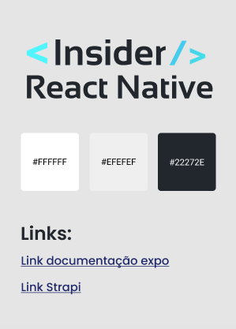
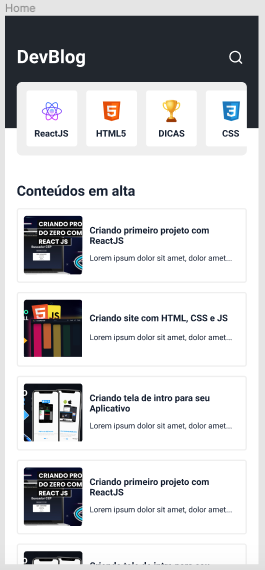
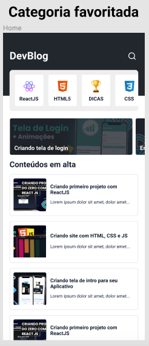
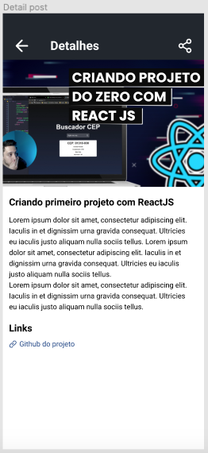
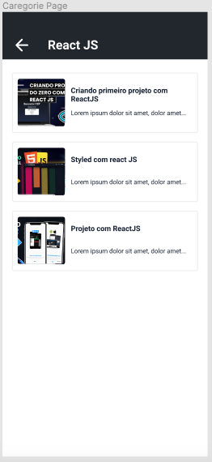
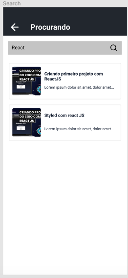

    <h1> DevBlog </h1>

 

   

 
 

<h3 align = "center">
  REACT NATIVE INSIDER 5
</h3>

| | | | |
|:-------------------------:|:-------------------------:|:-------------------------:|:-------------------------:|
| | ||||
 

 <a href="#target">Target</a> •
 <a href="#technologies">Technologies</a> •
 <a href="#route">Route</a> 

 
 

<h2> 💡 Target </h2>
Build a blog in React Native for Android and iOS mobiles

 

<h2> 🛠 Technologies </h2>
The main technologies that has been used in this project were:
 
 |                  Type                  |                Tools                |                                 References                                  |
| :------------------------------------: | :---------------------------------: | :-------------------------------------------------------------------------: |
|       Programming Language (App)       |                REACT NATIVE                 |              https://reactnative.dev/                      | 
|       Open source platform             |                EXPO                         |              https://expo.dev/                             | 
|                   IDE                  |        VISUAL STUDIO CODE (VS CODE)         |              https://code.visualstudio.com/                |
|        Design Interface Tool           |         FIGMA  (Prototype - UX/UI)          |              https://www.figma.com/                        |
|       Navigation between pages         |              REACT NAVIGATION               | https://reactnavigation.org/                          |
|    Open source Node.js Headless CMS    |                   STRAPI                    | https://strapi.io/                                           |
| Promise based HTTP client - browser & Node.js |             AXIOS                    | https://axios-http.com/                               |
|       Data persistence on device       |                ASYNC STORAGE                | https://react-native-async-storage.github.io/async-storage/docs/usage/          |
|       Animation Library                |             REACT NATIVE ANIMATABLE         | https://github.com/oblador/react-native-animatable           |

 
 

  
  
  
  
  
  
   
   

 

<h2> 🔎 Route </h2>

<ol>
    <li>Part 1 - Set the development environment (Infrastructure)
        
      <ul>
        <li>Build the project prototype: https://www.figma.com/file/15HnazfsI1NFV13fIXy1wu/React-Native-Insider-5?node-id=0%3A1</li>
        <li>Install VS Code (IDE)</li>
        <li>Install Expo CLI: npm install --global expo-cli</li>
        <li>Create a new project: expo init my-app</li>
        <li>Navigate to project directory: cd my-app</li>
        <li>Start the development server: expo start</li>
        <li>Configure the Expo Go on a mobile device or use an emulator</li>
        <li>Open the app on a mobile device: 
            * On your iPhone or iPad, open the default Apple "Camera" app and scan the QR code you see in the terminal
            * On your Android device, press "Scan QR Code" on the "Projects" tab of the Expo Go app and scan the QR code you see in the terminal.</li>
        <li>Open the project on VS Code</li>
        <li>Install React Navigation on project: 
            expo install @react-navigation/native 
            expo install react-native-screens 
            expo install react-native-safe-area-context
            expo install @react-navigation/native-stack</li>
      </ul>
       
    </li>
     
    <li>Part 2 - Build API (Backend) to be consumed
      <ul>
        <li>Install Strapi: npx create-strapi-app@latest my-project</li> 
        <li>Set you admin user</li>
        <li>Create Database</li>
        <li>Create new Tables: Category and Post</li>
        <li>Relationship between tables - Category has many Posts</li>
        <li>Populating Tables</li>
        <li>Create a new Post</li>
        <li>Go to Settings > User & Permissions Plugin > Roles > Public</li>
        <li>In Category: check find and findOne</li>
        <li>In Post: check find and findOne</li>
        <li>Save permissions</li>
        <li>*** Obs.: to structure a API endpoint result view on Google Chrome: 
            3 points > More tools > Extensions > Menu hamburger > Open Chrome Web Store
            Enter Json viewer and press enter
            Choose the first one (Highlighted)
            Select "Use on Chrome" 
            Click "Add extension" 
            Then, reloads the page</li>
        <li>Stop the service</li>
        <li>Enter API folder: cd blog-api</li>
        <li>Run project: npm run develop</li>
        <li>Access the server: https://localhost:1337</li>
        <li>Login with admin credentials</li>
         
      </ul>
     
    <li>Part 3 - Mobile Layout: Interface and UX</li>
      <ul>  
        <li>Build the Home page: ./src/pages/Home/index.js</li>
        <li>Setting routes: ./src/routes.js</li>
        <li>Update ./App.js</li>
        <li>Repeat the previous procedures for Detail, CategoryPosts and Search pages</li>
        <li>Set header for the pages: ./src/routes.js</li>
        <li>Use SafeAreaView to avoid broken layout: ./src/pages/Home/index.js</li>
        <li>Install Axios (HTTP request) module: expo install axios</li>
        <li>Install Async Storage module: expo install @react-native-async-storage/async-storage</li>
        <li>Stop and restart server</li>
        <li>React Hooks usage</li>
        <li>Creating server: ./src/services/api.js
            * Obs.: React Native requires a safe connection (e.g. https://)
            When it is not possible, we need to find our device ipconfig (IPv4)
            Then, substitute "localhost" with this numbers (e.g. http://192.168....)
        </li>
        <li>Install react-native-dotenv module: expo install react-native-dotenv</li>
        <li>Enter .env on .gitignore</li>
        <li>Create a .env file for sensible data: ./.env</li>
        <li>Go to the Home page: ./src/pages/Home/index.js</li>
        <li>Recover the api info and build the posts list</li>
        <li>Subdividing some parts in Components: ./src/components</li>
        <li>Creating features/functionalities</li>
        <li>Create a favorite service: ./src/services/favorite.js</li>
        <li>Create a favorite component: ./src/components/FavoritePost/index.js</li>
        <li>Favoriting categories, save on AsyncStorage and show them on screen: ./src/pages/Home/index.js</li>
      </ul>
       
    </li>
     
    <li>Part 4 - Bringing the project to life
        
      <ul>
        <li>Request posts on Home page: ./src/pages/Home/index.js</li>
        <li>Build PostItem component: ./src/components/RenderItem/index.js</li>
        <li>Link Posts from Home to Details page</li>
        <li>Create Detail interface: ./src/pages/Detail/index.js</li>
        <li>Using ScrollView for long items</li>
        <li>Install React-Native-Webview: expo install react-native-webview</li>
        <li>Create a LinkWeb modal component (link from post): ./src/components/LinkWeb/index.js</li>
          
      </ul> 
       
    </li> 
    <li>Part 5 - Adding features
        
      <ul>
        <li>Build Search input: ./src/pages/Search/index.js</li>
        <li>Find a desirable post from title</li>
        <li>Show posts found on screen</li>
        <li>Only stop showing device keyboard if found a post</li>
        <li>Update Home page with refresh option</li>
        <li>Build CategoryPosts page: ./src/pages/CategoryPosts/index.js</li>
        <li>Adding some animations (React Native Animatable): expo install react-native-animatable</li>
        <li>Use animation on Home page</li>
      </ul> 
    </li>
</ol>

 
 

